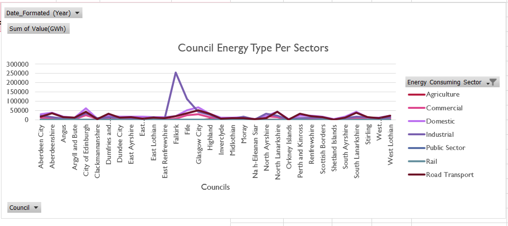
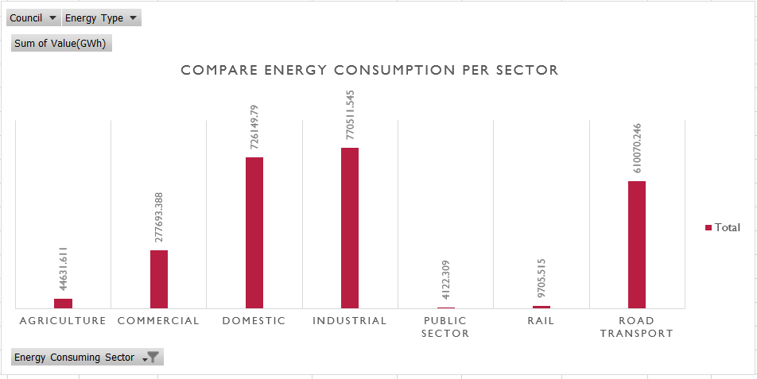

# Energy Consumption in Scottish Council Areas (2005–2020)

<p align="right">
  
</p>
<h1 align="center">SALAWUDEEN IBRAHIM</h1>

<div align="center">
  <video width="640" height="360" controls autoplay muted>
    <source src="Asset/Image/Screen-Recording-2025-07-24-2251.mp4" type="video/mp4">
    Your browser does not support the video tag.
  </video>
</div>

# 📘 Table of Contents

- [Introduction](#introduction)
- [Objective](#objective)
- [Aim](#aim)
- [Problem Statement](#problem-statement)
- [Data Sources](#data-sources)
- [Methodology](#methodology)
  - [Project Methodology Flow](#project-methodology-flow)
  - [➤ 1. Convert CSV to Excel Format](#️1-convert-csv-to-excel-format)
    - [CSV to Excel Conversion Steps – Diagram View](#csv-to-excel-conversion-steps--diagram-view)
  - [➤ 2. Data Cleaning and Preprocessing](#️2-data-cleaning-and-preprocessing)
  - [➤ 3. Exploratory Data Analysis (EDA)](#️3-exploratory-data-analysis-eda)
  - [➤ 4. Visual Analysis and Graphical Insights](#️4-visual-analysis-and-graphical-insights)
  - [➤ 5. Predictive Modeling with Linear Regression](#️5-predictive-modeling-with-linear-regression)
- [Key Findings](#key-findings)
- [Conclusion](#conclusion)
  - [Support for Policy Recommendations](#support-for-policy-recommendations)
  - [Sustainability Planning](#sustainability-planning)


## Introduction

The Scottish Government publishes annual energy consumption data for all 32 council areas in Scotland. This dataset spans the years 2005 to 2020 and includes various energy types—such as electricity, gas, coal, and petroleum products—across multiple consumption sectors including domestic, transport, public sector, and industrial & commercial use.

The dataset includes several energy sources such as:

- **Electricity**
- **Gas**
- **Coal**
- **Manufactured Fuels**
- **Petroleum Products** (e.g., diesel, petrol, heating oil)
- **Bioenergy & Wastes** (where available)

It also categorizes energy consumption by sector, including:

- **Domestic** – energy used in households for heating, lighting, and appliances
- **Agriculture**
- **Rail**
- **Road Transport** – fuel used in road transport and other transportation modes
- **Public Sector** – energy consumed by government and public services
- **Industrial & Commercial** – usage by manufacturing, construction, services, and other businesses


## Objective

The primary objective of this project is to analyze and interpret the Scottish Government’s annual energy consumption data from 2005 to 2020 across all 32 council areas in Scotland. The aim is to gain a deeper understanding of how energy is used across different regions, energy types, and economic sectors.

Specifically, the project seeks to:

- **Identify trends** in energy consumption over time.
- **Compare consumption patterns** across different council areas.
- **Evaluate sector-specific usage** such as domestic, transport, public sector, and industrial & commercial.
- **Assess the impact of policy changes** or external factors (e.g., economic shifts, climate goals) on energy use.
- **Support climate action planning** by providing data-driven insights to local authorities and policymakers.
- **Monitor progress toward sustainability goals**, including Scotland’s commitment to net-zero carbon emissions.

By achieving these goals, the project contributes to a better-informed energy strategy, encourages energy efficiency, and supports the broader transition to a low-carbon economy in Scotland.

## Aim 
This project aims to uncover meaningful insights into Scotland’s energy usage, sectoral demand, and changes over time. The outcome will support policy recommendations, sustainability planning, and energy efficiency assessments.

## Problem Statement

As Scotland moves toward its ambitious climate goals such as achieving net-zero greenhouse gas emissions by 2045—understanding how, where, and why energy is consumed at the local level is critical. However, the challenge lies in:

- **Fragmented data**: Energy consumption data is often large, technical, and difficult to interpret without specialized tools or analysis.
- **Regional disparities**: Different council areas have unique energy usage patterns influenced by geography, infrastructure, population density, and industrial activity.
- **Lack of actionable insights**: Raw data alone does not provide the clear insights needed by policymakers, planners, and stakeholders to implement effective energy efficiency strategies or decarbonization plans.

Without a structured analysis of long-term energy consumption trends across Scotland's 32 council areas, it becomes difficult to:

- Benchmark progress against national energy and climate targets.
- Identify high-consumption areas or sectors requiring intervention.
- Tailor local energy strategies based on real-world data.
- Monitor the effectiveness of policies over time.

## Data Sources

The primary data source used in this project is:

- **Scottish Government Energy Statistics Hub**  
  [https://www.gov.scot/collections/energy-statistics/](https://www.gov.scot/collections/energy-statistics/)  
  This dataset provides detailed local authority-level energy consumption data from 2005 to 2020. It includes breakdowns by fuel type and end-use sector.

Additional supporting references may include:

- UK Department for Energy Security and Net Zero (DESNZ)
- Scottish Environmental Protection Agency (SEPA)
- Local authority climate action reports
- National Records of Scotland (for population and household context)

## Methodology

The following structured methodology was adopted to carry out this energy consumption analysis project. Each step builds upon the previous one to ensure a clean, insightful, and actionable outcome.

### Project Methodology Flow

| Step | Description |
|------|-------------|
| ✅ **Step 1** | **Convert CSV to Excel Format** <br>Prepare the dataset by converting from `.csv` to `.xlsx` for better handling and compatibility. |
| ⬇️ | |
| 🔧 **Step 2** | **Data Cleaning and Preprocessing** <br>- Check for null values <br>- Rename columns <br>- Remove rows with "Scotland", "All", and "Industrial & Commercial" (combined category) <br>- Create another column date assuming the data was collet first of each month  |
| ⬇️ | |
| 📊 **Step 3** | **Exploratory Data Analysis (EDA)** <br>Analyze trends, patterns, outliers, and the overall structure of the dataset. |
| ⬇️ | |
| 📈 **Step 4** | **Visual Analysis and Graphical Insights** <br>Create meaningful visuals such as line charts, bar graphs, heatmaps, and maps to identify trends and comparisons. |
| ⬇️ | |
| 🔮 **Step 5** | **Predictive Modeling with Linear Regression** <br>Use regression to forecast energy consumption over the next 5 years. |
| ⬇️ | |
| 📊 **Step 6** | **Dashboard Development** <br>Build an interactive dashboard for dynamic exploration of the dataset and findings. |
| ⬇️ | |
| 📝 **Step 7** | **Key Findings and Conclusion** <br>Summarize insights, highlight key patterns, and link conclusions to policy or sustainability goals. |


### ➤ 1. Convert CSV to Excel Format
The original dataset, provided in CSV format, is first converted to Excel format (`.xlsx`) for easier manipulation, documentation, and integration with visualization tools like Excel.

#### CSV to Excel Conversion Steps – Diagram View

                    ┌────────────────────────────┐
                    │      Paste Data            │
                    │  (into any Excel cell)     │
                    └────────────┬───────────────┘
                                 │
                                 ▼
                    ┌────────────────────────────┐
                    │     Select the Data        │
                    │  (highlight the full range)│
                    └────────────┬───────────────┘
                                 │
                                 ▼
                    ┌────────────────────────────┐
                    │   Click "Text to Columns"  │
                    │  (under the Data tab)      │
                    └────────────┬───────────────┘
                                 │
                                 ▼
                    ┌────────────────────────────┐
                    │    Choose "Delimited"      │
                    │ (in the Convert wizard)    │
                    └────────────┬───────────────┘
                                 │
                                 ▼
                    ┌────────────────────────────┐
                    │   Select Delimiter: Comma  │
                    │ (check only the comma box) │
                    └────────────┬───────────────┘
                                 │
                                 ▼
                    ┌────────────────────────────┐
                    │           Done! ✅          │
                    │  Data is split into columns│
                    └────────────────────────────┘


<div style="display: flex; flex-wrap: wrap; gap: 16px; justify-content: center;">

  <div style="flex: 1 1 200px; max-width: 220px; text-align: center;">
    
    <p>Raw CSV data</p>
  </div>

  <div style="flex: 1 1 200px; max-width: 220px; text-align: center;">
    
    <p>Data Separating</p>
  </div>

  <div style="flex: 1 1 200px; max-width: 220px; text-align: center;">
    
    <p>Selecting Delimited</p>
  </div>

  <div style="flex: 1 1 200px; max-width: 220px; text-align: center;">
    
    <p>Selecting General</p>
  </div>

  <div style="flex: 1 1 200px; max-width: 220px; text-align: center;">
    
    <p>Final Data Preview</p>
  </div>

</div>


### ➤ 2. Data Cleaning and Preprocessing
Data cleaning is crucial to ensure the dataset is accurate, reliable, and analysis-ready.

- **Check for null or missing values**: Identify and address any gaps or inconsistencies in the data.

```excel
=IF(COUNTA(A2:I19009)<ROWS(A2:I19009)*COLUMNS(A2:I19009), "Has Blanks", "No Blanks")
```

| Check Description       | Result          |
|-------------------------|-----------------|
| Null Values / Blanks    | No Blanks Found |


- **Rename columns**: FeatureName As council, and delete Measurement and Units column.

<p align="center">
  
</p>

<p align="center"><strong>Figure:</strong> Rename and delete unnecessary columns during data cleaning</p>
  
- **Remove unnecessary data**:
  
  - Drop rows where `Council` includes "Scotland" as they represent national aggregates.

<p align="center">
  
</p>

<p align="center"><strong>Figure:</strong> Filter out rows where 'Council' is listed as 'Scotland'</p>

  - Exclude generic entries such as "All" from both `Energy Type` and `Energy Consuming Sector`.

<p align="center">
  
</p>

<p align="center"><strong>Figure:</strong> Filter out rows where <code>Energy Type</code> is "All"</p>
    
  - Remove "Industrial & Commercial" as a combined category to avoid duplication, since the sectors also exist as stand-alone entries.

<p align="center">
  
</p>

<p align="center"><strong>Figure:</strong> Remove rows where <code>Energy Consuming Sector</code> is "All" or "Industrial & Commercial" (to avoid duplication)</p>
    
  - To facilitate time-series analysis and visualization, we need to convert the `Year` column into a proper `Date` format. Since the original dataset only includes the year (e.g., `2010`, `2011`), we will create a new column called `Date` by assuming that data was      collected on the **1st of January** of each year.

```excel
=IF(COUNTA(A2:I19009)<ROWS(A2:I19009)*COLUMNS(A2:I19009), "Has Blanks", "No Blanks")
```

<div style="display: flex; gap: 20px; flex-wrap: wrap; justify-content: center;">

  <div style="flex: 1 1 300px; text-align: center;">
    
    <p><strong>Step 1:</strong> Date Column Formula</p>
  </div>

  <div style="flex: 1 1 300px; text-align: center;">
    
    <p><strong>Step 2:</strong> Resulting Date Column</p>
  </div>

</div>

### ➤ 3. Exploratory Data Analysis (EDA)
Perform an initial examination of the dataset to understand:


- Descriptive Statistics by Energy Type


| Energy Type            | Mean    | Median   | Mode     | Std Dev   | Variance     | Min   | Max       | Skewness  | Kurtosis   |
|------------------------|---------|----------|----------|-----------|--------------|-------|-----------|-----------|------------|
| Coal                   | 7.71    | 0.2025   | 0        | 49.66     | 2466.35      | 0     | 954.708   | 11.99     | 163.79     |
| Electricity            | 325.16  | 234.64   | 235.515  | 300.97    | 90581.09     | 19.801| 2167.704  | 2.37      | 7.71       |
| Gas                    | 536.27  | 367.491  | 0        | 601.02    | 361219.92    | 0     | 3781.715  | 2.35      | 6.58       |
| Bioenergy & Wastes     | 36.13   | 7.6765   | 0        | 112.14    | 12575.32     | 0     | 1393.516  | 7.05      | 61.12      |
| Petroleum Products     | 303.16  | 27.609   | 0        | 1138.58   | 1296363.95   | 0     | 20254.967 | 10.19     | 129.79     |
| Manufactured Fuels     | 14.34   | 2.5875   | 0        | 75.50     | 5700.43      | 0     | 741.017   | 7.94      | 63.03      |


- Descriptive Statistics by Energy Consuming Sector


| Energy Consuming Sector | Mean    | Median   | Mode   | Std Dev   | Variance     | Min   | Max       | Skewness  | Kurtosis   |
|-------------------------|---------|----------|--------|-----------|--------------|-------|-----------|-----------|------------|
| Rail                    | 9.48    | 0.07     | 0      | 17.67     | 312.40       | 0     | 86.996    | 2.36      | 5.37       |
| Domestic                | 236.38  | 15.625   | 0      | 479.61    | 230025.0     | 0     | 3781.715  | 3.60      | 15.86      |
| Public Sector           | 4.03    | 0.831    | 0      | 9.73      | 94.75        | 0     | 81.734    | 4.45      | 22.08      |
| Agriculture             | 43.59   | 0.9655   | 0      | 89.87     | 8077.05      | 0     | 519.838   | 3.06      | 9.93       |
| Road Transport          | 595.77  | 110.588  | 4.345  | 815.64    | 665274.58    | 0.168 | 3265.728  | 1.50      | 1.24       |
| Commercial              | 108.47  | 3.6185   | 0      | 206.38    | 42593.26     | 0     | 1834.391  | 3.29      | 14.65      |
| Industrial              | 250.82  | 45.326   | 0      | 1133.19   | 1284112.08   | 0     | 20254.967 | 11.89     | 156.50     |


The analysis of energy consumption across sectors and energy types reveals significant variations in usage patterns. Road Transport, Industrial, and Domestic sectors are the largest consumers, with Road Transport averaging 595.77 GWh due to heavy fuel usage, and Industrial consumption reaching 250.82 GWh with extreme peaks from heavy industries. Domestic consumption, with a mean of 236.38 GWh, is also substantial but unevenly distributed, as indicated by its high skewness and kurtosis.

Sectors such as Rail, Public, and Agriculture show relatively low average consumption, though they have occasional spikes in specific locations. Commercial energy use, with a mean of 108.47 GWh, is dominated by a few high-consumption businesses such as malls and data centers.

Looking at energy types, Gas (536.27 GWh) and Electricity (325.16 GWh) are the most consumed, reflecting their role in both domestic and industrial applications. Petroleum products (303.16 GWh) and coal (7.71 GWh) also show concentrated but significant usage, with petroleum displaying extreme outliers.

To optimize energy use, efficiency measures should target high-demand sectors like industry and transport. Electrification, renewable energy adoption, and demand-side management in domestic and commercial sectors could significantly reduce peak loads and improve sustainability.

### ➤ 4. Visual Analysis and Graphical Insights

- **Total Annual Energy Consumption by Fuel Type**
    The overall energy consumption declined from 171,340 GWh in 2005 to 135,985 GWh in 2020. This suggests a gradual reduction in energy demand or a shift towards energy efficiency, possibly due to policy, technology, or behavioural changes.


Petroleum Products:

Remained the largest contributor, totaling over 1 million GWh across the years. However, its usage dropped significantly from 76,542 GWh in 2005 to 57,304 GWh in 2020—reflecting reduced transport fuel consumption or a switch to alternatives.

Gas & Electricity:

Gas consumption stayed high but declined slightly—from 60,943 GWh in 2005 to 48,404 GWh in 2020. Electricity dropped steadily, from 29,505 GWh in 2005 to 22,403 GWh in 2020, possibly due to decarbonization and renewable integration.

Coal:

Showed a sharp decline from 1,637 GWh to just 690 GWh, showing the phase-out of coal as a major energy source.

Bioenergy & Wastes:

Consumption rose dramatically, from 1,590 GWh in 2005 to nearly 6,894 GWh in 2020. This indicates a strong policy push toward renewable energy and waste-to-energy technologies.

Manufactured Fuels:

Saw a significant drop, especially in the later years (e.g., only 290 GWh in 2020), showing reduced reliance on these processed fuels.

- **Total Annual Energy Consumption by Sector**


This data shows how energy demand varies across sectors over time. From a user’s point of view, each sector represents a category of energy consumers households, farms, factories, offices, rail transport, and road vehicles.

Domestic Sector:

This is the largest energy-consuming sector with over 726,000 GWh consumed over the period. It includes household energy for lighting, heating, and appliances, indicating significant energy demand from residential users.

Industrial Sector:

Nearly 771,000 GWh consumed, making it the top sector overall. Industrial users, such as factories and heavy manufacturing, rely heavily on energy for operations.

Road Transport:
The third-largest consumer at 610,070 GWh, showing the heavy energy demands of personal and commercial transportation (mostly petroleum products).

Commercial Sector:

Consumed 277,693 GWh, representing businesses, retail, and offices significant but less than residential and industrial usage.

Agriculture, Rail, Public Sector:

Smaller consumers. Agriculture consumed 44,631 GWh, Rail used 9,705 GWh, and the Public Sector used 4,122 GWh, mainly for public infrastructure and transport.

**Notes:**

The industrial and domestic sectors are the primary targets for energy efficiency improvements.

The decline in 2020 reflects the impact of COVID-19 restrictions, particularly on transport and commercial sectors.

Continued growth in clean transport and efficient housing can further reduce demand in top sectors.


- **Council Energy Type Per Sectors**



This dataset breaks down total energy consumption across Scottish councils by sector. As an energy user, it reveals how demand varies by geography and usage type. Industrial and domestic users dominate overall consumption, with over 770,000 GWh and 726,000 GWh, respectively. This highlights the energy-intensive nature of industry and the consistent, high demand from households for heating, lighting, and appliances.

Among councils, Falkirk stands out due to massive industrial energy use (253,910 GWh), likely tied to heavy manufacturing or energy infrastructure. Glasgow City and City of Edinburgh show extremely high domestic and commercial consumption, reflecting dense urban populations and extensive business activity. Meanwhile, rural councils like Aberdeenshire and Highland exhibit high energy use in agriculture and road transport, suggesting broad land use and reliance on vehicles.

Smaller councils such as Na h-Eileanan Siar and Orkney Islands consume relatively little, emphasizing their small populations and limited industrial presence. Rail energy use remains low overall, while road transport (610,000 GWh total) remains a major contributor in every region.


- **Council-Level Energy Consumption by Sector**


This dataset provides a comprehensive view of energy consumption (in GWh) across all Scottish councils, broken down by sector. Domestic (726,149.79 GWh) and industrial (770,511.55 GWh) sectors dominate energy usage, highlighting the energy demands of homes and industry. Road transport is also a major contributor, with 610,070.25 GWh, reflecting Scotland’s reliance on vehicles for personal and commercial use.

Falkirk reports the highest single-sector consumption with 253,910.50 GWh in the industrial sector, likely tied to its central location and manufacturing infrastructure. Glasgow City and City of Edinburgh rank high in domestic and commercial usage due to their large populations and dense commercial activity.

Rural councils like Aberdeenshire, Highland, and Dumfries and Galloway have significant energy usage in agriculture and road transport, supporting expansive land and farming operations. Conversely, island councils such as Orkney, Shetland, and Na h-Eileanan Siar have much lower overall consumption due to smaller populations and limited industrial activities.

- **Annual Energy Consumption by Sector (2005–2020)**


Between 2005 and 2020, Scotland's total energy consumption steadily declined from 171,340 GWh in 2005 to 135,986 GWh in 2020, reflecting increased energy efficiency, changing behaviors, and possibly the transition to cleaner technologies.

The domestic and industrial sectors remained the top consumers of energy, with cumulative totals of 726,149 GWh and 770,512 GWh respectively. Despite small year-to-year fluctuations, both sectors experienced a downward trend, likely due to improvements in home insulation, appliances, and industrial processes.

The commercial sector, consuming 277,693 GWh over the period, also showed a gradual decrease, especially noticeable after 2016. Road transport, with 610,070 GWh, showed more variation—rising until around 2017 and then dropping sharply in 2020, likely due to COVID-19 lockdowns.

Energy use in agriculture remained relatively stable (~2,900–3,000 GWh annually), while the public sector and rail consumed significantly less overall, at 4,122 GWh and 9,705 GWh, respectively.

- **Compare Energy Consumption Per Sector**



The grand total energy usage stands at approximately 2,442,884 GWh, distributed among seven key sectors. The industrial sector is the largest consumer, accounting for over 770,511 GWh, reflecting Scotland’s strong manufacturing, refining, and production presence. Closely following is the domestic sector, with 726,150 GWh, highlighting the significance of household energy demand for heating, lighting, and appliances.

Road transport ranks third, consuming 610,070 GWh, underscoring the sector’s continued reliance on fossil fuels despite efforts to promote electric vehicles and public transport. The commercial sector also plays a significant role, using 277,693 GWh, likely driven by businesses, offices, and retail activities.

In contrast, agriculture consumed 44,632 GWh, reflecting its smaller share in overall energy use, while rail transport (9,706 GWh) and the public sector (4,122 GWh) had relatively minor contributions. These figures reinforce the importance of focusing decarbonization efforts on industrial, domestic, and transport sectors. Enhancing energy efficiency and shifting toward renewable energy sources in these areas will be crucial for Scotland to meet its net-zero carbon targets.


- **Energy Consumption by Fuel Type in Scotland (2005–2020)**


Between 2005 and 2020, Scotland’s total energy consumption across all councils amounted to approximately 2,442,884 GWh, derived from six primary fuel types: Petroleum Products, Gas, Electricity, Coal, Bioenergy & Wastes, and Manufactured Fuels.

Petroleum products were the dominant energy source, with a total of over 1,086,517 GWh, reflecting high dependency on oil-based fuels, especially in transport and industry. Gas followed closely, totaling 823,708 GWh, indicating its widespread use for heating and electricity generation.

Electricity consumption remained consistently high over the years, contributing about 420,304 GWh. Though demand slightly declined toward 2020, it remains a key component of Scotland’s energy mix.

Bioenergy & wastes showed a steady increase, from 1,590 GWh in 2005 to 6,894 GWh in 2020, totaling 73,999 GWh overall—reflecting growing investment in renewable and waste-to-energy technologies.

Meanwhile, coal and manufactured fuels declined significantly due to environmental concerns and shifts toward cleaner energy. Coal use dropped from 1,637 GWh in 2005 to just 690 GWh in 2020.

This transition highlights Scotland’s gradual shift from fossil fuels to more sustainable energy sources in pursuit of its net-zero emissions target.

- **Total Energy Consumption by Council Area in Scotland (2005–2020)**


From 2005 to 2020, Scotland's total energy consumption across all council areas reached approximately 2,442,884 GWh. The highest consumption was recorded in Falkirk, with over 304,548 GWh, largely driven by its industrial sector, which dominates its energy profile.

Fife (226,948 GWh), Glasgow City (194,814 GWh), and City of Edinburgh (168,932 GWh) also had notably high energy usage, reflecting their large populations, commercial activities, and transport demands.

Other high-consuming areas include North Lanarkshire (125,727 GWh), Highland (116,361 GWh), South Lanarkshire (113,525 GWh), and Aberdeenshire (105,031 GWh), which combine both urban centers and rural industries like agriculture and energy production.

Smaller and island councils such as Orkney Islands (8,168 GWh), Shetland Islands (9,372 GWh), and Na h-Eileanan Siar (9,575 GWh) consumed the least, consistent with their lower population density and limited industrial activity.

**Note:** This distribution reveals how energy use correlates strongly with population, industrial concentration, and transport infrastructure, and underscores the diversity of Scotland's energy landscape—from major urban hubs to remote rural communities.

- **Scotland Energy Consumption by Fuel Type (2005–2020)**


Between 2005 and 2020, Scotland consumed approximately 2,442,884 GWh of energy across six main fuel categories. The largest share came from petroleum products, totaling 1,086,517 GWh, driven primarily by transport and industry. Gas followed, with 823,708 GWh, commonly used for heating, domestic, and industrial purposes.

Electricity was the third most consumed source, with 420,304 GWh, showing relatively stable annual use around 25,000–29,000 GWh per year. While its share declined slightly over the years, it remains a crucial component of Scotland’s energy mix.

Bioenergy and wastes showed the strongest growth, rising from 1,590 GWh in 2005 to nearly 6,894 GWh in 2020, reflecting a national shift toward renewables and waste recovery.

In contrast, coal usage declined dramatically from 1,637 GWh in 2005 to just 690 GWh by 2020, marking Scotland’s move away from fossil fuels. Similarly, manufactured fuels saw a drop from over 1,100 GWh to just 290 GWh in the same period.


- **Scotland Energy Consumption by Sector (2005–2020)**


Between 2005 and 2020, Scotland consumed a total of approximately 2.44 million GWh of energy across key sectors. The industrial sector accounted for the largest share, consuming 770,512 GWh, reflecting the sector’s heavy reliance on energy for production and manufacturing activities.

Domestic energy consumption was also high at 726,150 GWh, driven by heating, electricity, and household use, highlighting the importance of residential demand in Scotland’s overall energy profile.

Road transport emerged as the third-largest consumer at 610,070 GWh, reflecting the continued dependence on fossil fuels for transportation. The commercial sector followed with 277,693 GWh, supporting offices, retail, and other business services.

Other sectors had relatively lower consumption. Agriculture used 44,632 GWh, rail accounted for 9,706 GWh, and the public sector consumed 4,122 GWh over the 16-year period.

Annual data reveals a gradual decline in total energy usage, from 171,340 GWh in 2005 to 135,986 GWh in 2020, reflecting improvements in energy efficiency, economic shifts, and decarbonization efforts.

Overall, the data illustrates that while industrial and domestic sectors dominate consumption, transport remains a significant contributor, highlighting the need for continued transition to cleaner energy sources across all sectors.

### ➤ 5. Predictive Modeling with Linear Regression

The **linear regression** is use to forecast energy consumption trends over the next five years. This involves:

Selecting key variables (year, sector, fuel type), Training and testing a regression model, Evaluating the model's performance, Making future predictions based on historical trends.

- **Bioenergy & Wastes Energy Use in Scotland (2005–2020)**


From 2005 to 2020, Scotland's consumption of Bioenergy & Wastes has shown a significant and consistent upward trend. The total energy consumed from this source across all sectors over this 16-year period was approximately 73,999 GWh.

In 2005, only 1,590 GWh of energy came from Bioenergy & Wastes. This figure more than quadrupled by 2010, reaching 4,823 GWh, and continued to rise sharply through the decade. By 2014, it had surged to 6,517 GWh, and by 2020, it peaked at 6,894 GWh, indicating sustained investment and growing reliance on renewable and waste-based energy sources.

The data illustrates Scotland’s strategic shift toward renewable energy and circular economy practices, likely driven by climate policy targets, incentives, and local generation initiatives. The jump from 3,844 GWh in 2009 to 4,823 GWh in 2010 alone reflects a key point of expansion in infrastructure or policy support.

This rising trend signifies Bioenergy’s growing role in decarbonizing Scotland’s energy mix, especially in sectors that can utilize biomass, waste-to-energy technologies, and organic feedstocks. It underlines a positive transition toward sustainability, reducing dependence on fossil fuels and lowering greenhouse gas emissions.

- **Coal Energy Consumption in Scotland (2005–2020)**

!Coal Energy Consumption in Scotland (2005–2020)[](Asset/Image/coal consumption.png)

Between 2005 and 2020, coal consumption in Scotland experienced a sharp and consistent decline, reflecting the nation’s transition toward cleaner and more sustainable energy sources. Over this 16-year period, total coal consumption amounted to approximately 23,675 GWh.

In 2005, coal contributed 1,637 GWh to the energy mix. This rose briefly to a peak of 2,206 GWh in 2008, likely due to energy demand or delays in renewable capacity growth. However, following this, coal use declined steadily as renewables and low-carbon sources gained prominence. By 2014, consumption had fallen to 1,318 GWh, and by 2020, it had dropped drastically to just 690 GWh, less than half of the 2005 level.

This downward trend clearly reflects Scotland’s climate goals and coal phase-out strategies, including the decommissioning of coal-fired plants and stricter emissions regulations. The sharp reductions after 2015 coincide with the closure of major coal facilities and increased investment in renewables like wind, solar, and bioenergy.

The data highlights Scotland’s progressive energy policy and its ongoing shift from fossil fuels to sustainable alternatives. Coal, once a staple of industrial energy supply, is now nearing complete obsolescence in Scotland’s modern energy landscape.


- **Electricity Consumption in Scotland (2005–2020)**


From 2005 to 2020, electricity consumption in Scotland totaled 420,304 GWh, showing a gradual but steady decline over the 16-year period. In 2005, total usage stood at 29,505 GWh, which was the highest in the dataset. By 2020, consumption had dropped to 22,403 GWh, marking a 24% decrease.

This consistent downward trend reflects various energy efficiency improvements, such as better-insulated buildings, more efficient appliances, and smarter energy management. Additionally, shifts in industrial activity, including the decline of heavy manufacturing and the transition toward service-based and digital economies, contributed to the reduction.

Electricity usage fell sharply during economic slowdowns (e.g., post-2008 financial crisis) and again in 2020, likely influenced by COVID-19-related restrictions which reduced commercial and industrial energy demand.

Despite the falling consumption, Scotland has increased its renewable electricity generation capacity, leading to a cleaner, more sustainable power mix. The decrease in demand, combined with a shift away from fossil fuels, underscores Scotland’s progressive transition to a low-carbon energy system.

In summary, the data reveals that Scotland is not only using less electricity but is also using it more efficiently and sustainably.


- **Gas Consumption in Scotland (2005–2020)**


Between 2005 and 2020, Scotland consumed a total of 823,707 GWh of gas, making it one of the largest energy sources in the country. In 2005, gas consumption peaked at 60,943 GWh. However, the following years saw a general decline, dropping to around 48,404 GWh by 2020 a 20.6% reduction over the period.

This downward trend was influenced by several key factors. First, energy efficiency measures in homes and businesses reduced overall demand. The retrofitting of buildings, improvements in insulation, and adoption of modern heating systems contributed to this reduction. Second, shifts in industrial processes, including a move away from gas-reliant manufacturing, played a role. Furthermore, Scotland’s growing investment in renewable energy sources helped offset the demand for fossil fuels like natural gas.

Despite fluctuations — such as minor rebounds in 2010 and 2020, the trend remained consistently downward, reflecting policy-driven efforts to decarbonize the energy sector. Notably, gas remains a significant part of the energy mix, particularly for heating and industrial use, but its role is gradually diminishing.

Overall, the data highlights a nationwide transition toward lower fossil fuel dependence and a more sustainable energy future.


- **Manufactured Fuels Consumption in Scotland (2005–2020)**


Between 2005 and 2020, Scotland consumed 14,681 GWh of manufactured fuels, a relatively small fraction of the national energy mix. Manufactured fuels include processed solid fuels like coke and briquettes, primarily used in industrial applications and some legacy heating systems.

Consumption peaked slightly in 2007 at 1,173.88 GWh, but steadily declined afterward. By 2020, usage had fallen sharply to just 290.2 GWh, representing a 74% decrease from 2005. This steep drop reflects the rapid obsolescence of these fuels as cleaner, more efficient alternatives have become mainstream.

The decline correlates with the de-industrialization of certain sectors and policy shifts toward decarbonization. Environmental regulations, rising costs of production, and improved access to natural gas and electricity have made manufactured fuels increasingly nonviable. Additionally, domestic users have largely transitioned to electric or gas heating systems, further shrinking demand.

Despite a few fluctuations, such as minor increases in 2013 and 2018, the overall trajectory has been downward. By the end of the period, manufactured fuels were virtually phased out in most sectors.

This trend underscores Scotland’s commitment to phasing out high-emission fuels in favor of a cleaner, more sustainable energy economy.


- **Petroleum Products Use in Scotland (2005–2020)**


Over the 16-year period from 2005 to 2020, Scotland consumed a total of 1,086,517 GWh of petroleum products, making it the largest single energy source among all types. Petroleum products include diesel, petrol, kerosene, and other oil-based fuels, widely used in transport, industry, and heating.

In 2005, usage peaked at 76,542 GWh, then experienced a gradual decline over the years, reaching 57,304 GWh by 2020—a 25% overall decrease. This reduction reflects improvements in vehicle fuel efficiency, increased use of electric vehicles, and government policies aimed at reducing carbon emissions.

The transport sector—especially road transport—is the main consumer of petroleum, and as more people shifted to public transport, hybrid, or electric vehicles, demand decreased. However, the decline wasn't steady—there were years like 2017 where usage spiked (69,415 GWh), suggesting temporary fluctuations due to market or policy conditions.

Despite the overall decline, petroleum still plays a dominant role in Scotland’s energy profile. Transitioning away from petroleum remains crucial for net-zero goals, especially in transport and off-grid heating.

This trend highlights Scotland's ongoing energy transition, though full decarbonization remains a work in progress.


## Key Findings

Summarize the major insights derived from the analysis.

**Summary Chart: Total Energy Consumption (2005–2020)**

| Energy Type            | Total GWh        | Share (%)  | Trend Summary                            |
|------------------------|------------------|------------|------------------------------------------|
| Petroleum Products     | 1,086,517 GWh    | 44.5%      | Declining steadily                       |
| Gas                    | 823,708 GWh      | 33.7%      | Slight decline, then stable              |
| Electricity            | 420,304 GWh      | 17.2%      | Slight decline with high stability       |
| Bioenergy & Wastes     | 73,999 GWh       | 3.0%       | Strong growth (renewable focus)          |
| Coal                   | 23,675 GWh       | 1.0%       | Sharp decline (phase-out of fossil fuels)|
| Manufactured Fuels     | 14,681 GWh       | 0.6%       | Declining, marginal usage                |


### Key Findings

1. Energy Type Trends

In 2005, the dominant energy source was Petroleum Products (76,542.43 GWh), followed by Gas and Electricity.
Bioenergy & Wastes has shown a consistent increase from 1,590.484 GWh in 2005 to 6,873.579 GWh in 2020, reflecting a shift towards renewable energy.
Coal consumption peaked in 2008 (2,205.75 GWh) due to a mix of delayed policy implementation, energy security concerns, and high winter demand, before significantly declining due to growing environmental regulation and cleaner energy alternatives.
Manufactured fuels and coal are steadily declining, indicating a phasing out of traditional fossil fuels.

2. Sectoral Energy Use

Agriculture energy use fluctuated over the years, peaking in 2016 (3,001.577 GWh), with a slight dip in 2008.
The Commercial sector experienced a noticeable dip in 2016 (12,914.017 GWh) compared to 2005 (19,776.548 GWh), indicating improved energy practices or reduced activity.
The Domestic sector shows a general decline in energy consumption over the period.
The Industrial & Commercial sectors combined showed reduced energy use over time, especially compared to 2005 levels (Industrial: 57,604.316 GWh).
The Public sector saw a sharp decrease in energy consumption from 482.689 GWh in 2005 to 124.307 GWh in 2020.
The Rail sector also showed declining usage, likely due to improved efficiency and electrification.

3. Regional Insights

Falkirk recorded the highest energy consumption (3,115,340 GWh), followed by Fife and Glasgow City.
These high-consumption regions rely predominantly on Petroleum products, Gas, and Electricity, while use of Coal has faded significantly.

The use of Bioenergy & Wastes is gradually increasing in these regions, which is promising for sustainability goals.
Forecasting & Linear Regression Insights
Predictive models indicate a steady decline in Petroleum Products and Manufactured Fuels usage across all sectors.

Gas usage is expected to slightly decrease, following a post-2009 trend.
Electricity usage is also projected to decline slightly, though it remains a stable energy source.

Coal is on a clear path to being phased out, aligning with sustainability targets.
Bioenergy & Wastes shows the most promising growth trajectory and may dominate in future if adopted more widely across sectors like Industry, Public, and Agriculture.

## Conclusion

Scotland's energy landscape is undergoing a meaningful transition. Between 2005 and 2020, reliance on traditional fossil fuels has declined, while renewable sources such as bioenergy are gaining momentum. This trend aligns with broader decarbonization goals and supports a low-carbon future. Sectoral shifts also suggest greater efficiency and adoption of cleaner technologies in domestic, commercial, and industrial areas.

### Support for Policy Recommendations

The data reveals clear opportunities for policy refinement:
Encourage continued investment in renewable infrastructure, especially bioenergy.
Implement incentives for low-carbon technologies in sectors still heavily reliant on fossil fuels, particularly Agriculture and Industry.
Promote electrification of transport, including public and freight rail, to reduce petroleum dependency.

### Sustainability Planning

Sustainability strategies should:

Prioritise decarbonizing high-consumption sectors (e.g., Industry, Road Transport).
Support councils with high energy usage (like Falkirk and Fife) with localized clean energy projects.
Expand community-based renewable energy programs and energy education campaigns.
Energy Efficiency Assessments
Key steps to improve efficiency:
Promote energy audits across sectors to identify waste and improve conservation.
Upgrade building insulation and heating systems in domestic and public sectors.
Enhance grid efficiency to support low-carbon transitions and manage peak loads.


